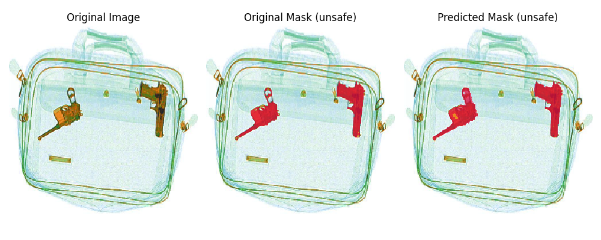
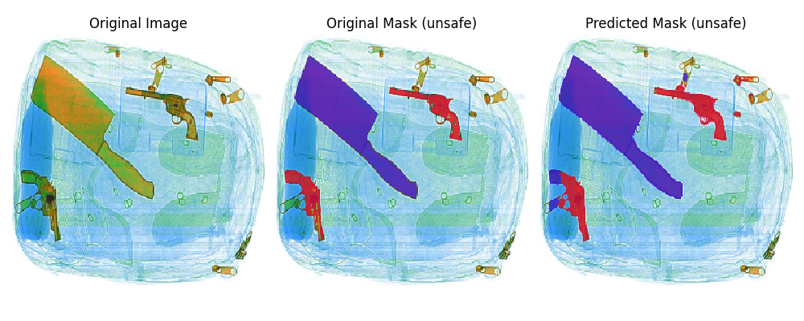

# Autonomous Detection and Segmentation of Prohibited Items in Luggage Using Deep Learning Techniques

## Introduction

## Dataset

You can access the original dataset and the cleaned dataset on [google drive](https://drive.google.com/drive/folders/1aPpMNyn600bHzc_hQHiIxKiJcLlJXTRP?usp=sharing).

The dataset is divided into 4 folders

- annotations
- gun
- knife
- safe

annotations includes the annotated masks for each corresponding image.

## Results

### Data Preparation

The dataset required cleaning to remove anomalies and reorganizing...

#### Cleaning

The dataset had following issues:

- The provided annotations were resized into 768x576, which resulted in objects getting a false outline due to interpolation.
- In some annotations irrelevant objects were highlighted (e.g. pliers).
- The labels were inconsistent throughout the dataset, varying across different batches of images.

Cleaning methodology:

- To remove interpolated outlines, closing was applied on the outline label.
- Irrelevant objects were identified and removed manually.
- Ensured consistency in labeling.
  |Class | Label|
  | ---- | ----|
  |Background | 0|
  |Gun | 1|
  |Knife | 2|

#### Reorganizing

For both the Binary Classification and Semantic Segmentation datasets, they were structured into two arrays:

- One array holds all the images.
- The second array contains corresponding classifications:
  - for Binary Classification, it denotes safe (0) or unsafe (1).
  - for Semantic Segmentation, it uses one-hot encoding for labels.

## Binary Classification

## Semantic Segmentation

Semantic Segmentation is used to assign class labels to each pixel in an image, categorizing them according to their visual content.

### Architecture

The U-Net architecture was utilized for this model with weighted categorical cross entropy as loss function.
The weights were used to counter class imbalance due to background.
|Class | Weight|
| ---- | ---- |
|Background | 0.35595721|
|Gun | 10.59244675|
|Knife | 10.38780955|

### Metrics

#### Loss Curve

#### Categorical Accuracy

#### F1 Score

#### Confusion Matrix

