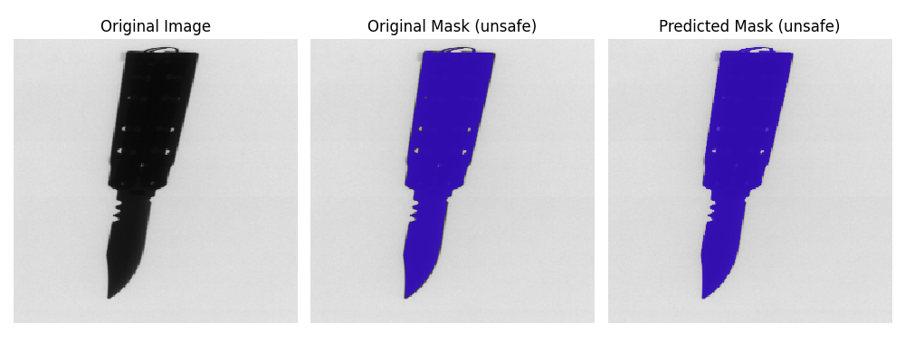

# Classification and Segmentation of Prohibited Items in Luggage Using Deep Learning Techniques

## Introduction

The goal of this project is to use deep learning techniques to develop a system capable of classifying and segmenting prohibited items within luggage images. This approach aims to enhance security screening processes by identifying unsafe images and highlighting objects that pose potential threats.

You can access the original dataset, cleaned dataset and trained models on [Google Drive](https://drive.google.com/drive/folders/1aPpMNyn600bHzc_hQHiIxKiJcLlJXTRP?usp=sharing).

## Project Overview

### Objectives

- **Classification:** Classify images as safe or unsafe.
- **Segmentation:** Highlight and segment the detected prohibited items.

### Methodology

This project involves several key steps:

- **Data Cleaning and Preparation:** The dataset required cleaning to remove anomalies and reorganize it for effective model training.
- **Model Training:** Developed and trained a custom deep learning model for object classification and segmentation.
- **Model Evaluation:** Assessed the performance of the trained model using relevant metrics to ensure high accuracy and reliability.
- **Implementation:** Integrated the trained model into a system that can process luggage images, highlighting prohibited items for security personnel.

## Dataset

The dataset is divided into 4 folders

- annotations
- gun
- knife
- safe

annotations includes the annotated masks for each corresponding image.

## Results

#### Confusion Matrix

## Requirements

Following versions were installed in a virtual env created by [miniconda](https://docs.anaconda.com/miniconda/miniconda-install/) to [enable GPU usage](https://www.tensorflow.org/install/pip#windows-native) with tensorflow.

- Python: 3.10.14
- Tensorflow: 2.10.1
- cudatoolkit: 11.2
- cudnn: 8.1.0
- Other Libraries: Listed in `requirements.txt`

### Jupyter Notebook Setup

To use this environment with Jupyter Notebook, follow these steps to add it as a kernel:

1. **Activate Your Environment:**

`conda activate your-environment-name`

2. **Install ipykernel:**

`conda install ipykernel`
OR

`pip install ipykernel`

3. **Add Environment as a Kernel:**

`python -m ipykernel install --user --name=your-environment-name`

4. **Launch Jupyter Notebook/Lab:**
   When you create or open a notebook, select your-environment-name from the kernel dropdown menu under Kernel > Change kernel.

## Additional Setup

- Download Datasets and Models:
  Download the datasets and trained models from [Google Drive](https://drive.google.com/drive/folders/1aPpMNyn600bHzc_hQHiIxKiJcLlJXTRP?usp=sharing) and place them in the appropriate directories as specified in the project documentation.

## Resources

These resources provided valuable insights and tutorials that aided in understanding and implementing components of this project.

- **YouTube Videos:**
  - [Multiclass semantic segmentation using U-Net](https://www.youtube.com/watch?v=XyX5HNuv-xE)
  - [Binary classification using Keras](https://www.youtube.com/watch?v=vF21cC-8G1U)
  - [Semantic segmentation using a small dataset for training (& U-Net)](https://www.youtube.com/watch?v=-XeKG_T6tdc)
  - [UNET for Person Segmentation | Human Image Segmentation | Semantic Segmentation | Deep Learning](https://www.youtube.com/watch?v=qrL22HEaUGA)
- **Articles:**
  - [A Simple Convolutional Neural Network (CNN) Classifier Based on Real Images](https://medium.com/@chenycy/a-simple-convolutional-neural-network-cnn-classifier-based-on-real-images-084110d52c18)

---

For more detailed information about the project, including methodology details, and additional insights, please refer to the docs.pdf document located in the docs folder of the project repository.
